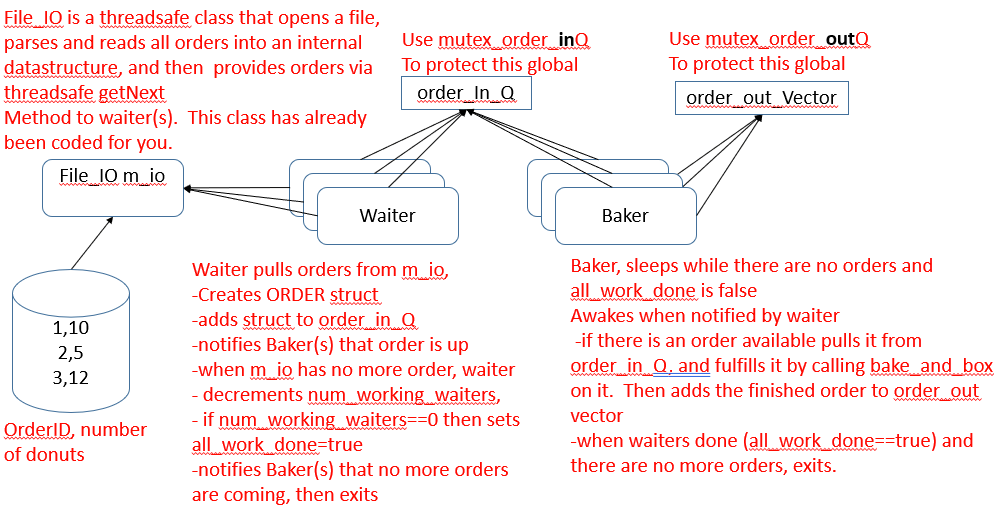
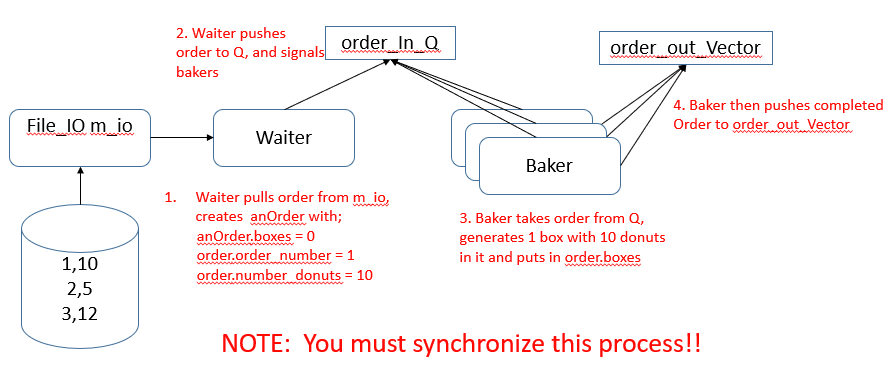

**CPSC 410**

**Project 4**
## Due Date:
Sat April 16 at midnight.

## Motivation: Topics covered by this project;

-   Threads, mutexes, condition variables

## Overview

You are to model a donut order fulfillment system. Multiple waiters take
orders for donuts, while bakers fill and box these orders (see below).

Note the 2 different synchronization objects needed for the 2 queues

As an example, suppose a Waiter is pulling in order 1, for 10 donuts
(see above). The process will follow this outline

## File_IO (all is given to you)

This set of functions is similar to what you did in project 2. Note that
it contains orders now. It is a threadsafe class which means that it
will work correctly when multiple waiters on different threads are
getting orders from it.

It reads a file that has an [unknown number]{.ul} of rows, and 2 columns
of integers. Assume there are no malformed rows (ie != 2 columns). It
looks like the following .

This file can have any name, but I will call it inlots.txt for the
purposes of this document. The first column is order_number, second is
number_donuts . File_IO provides functions to load this data into a
vector and sort it by order_number.

## Baker

You are given a header file and a stripped .cpp file. Please fill in the
cpp file. Please see header file for function explanations.

Additional notes: Baker must not start processing orders until they are
available. Do this by waiting for a signal from condition variable
cv_order_inQ (defined in 410_proj4.cpp and externed in externs.h). Baker
will also wait on all_work_done==true, when this happens no more orders
are coming.

## Waiter

You are given a header file and a stripped .cpp file. Please fill in the
cpp file. Please see header file for function explanation

Additional notes: You must use condition variable cv_order_inQ (defined
in 410_proj4.cpp and externed in externs.h) to signal the baker that
there are orders available in the order_in_Q or to signal that there are
no more orders available and the waiter is exiting.

You will have multiple waiters, and a global, num_working_waiters, that
tracks the number of active waiters. When a waiter is created, it will
increment this global, when a waiter exits it will decrement this
global. If the global ==0 then that waiter (and that waiter alone) will
set all_work_done to true to signal that all waiters are finished.

## 410_proj4.cpp

Use this file to test your solution. It will run several configurations
of your bakers and waiters. If they all run, you will get a total points
earned at the end.

## Other Information

Box.cpp and .h, used by baker when boxing donuts

Datastructs.h, holds ORDER info

PRINT.h contains a helpful threadsafe SAFEPRINT function that you can
use.

Externs.h contains external references to global variables, include
wherever you need those global variables.

> (extern is a promise to the compiler. It states that an externed
> variable is not defined in this file, but is in another. When all
> object files linked (remember compilation is
> preprocess-\>compile-\>link) the linker will find it. It's the only
> way to work with globals that must be shared amongst different
> compilation units without passing them as function references.)

## Directory Structure

Please do not modify the project directory structure

## Grading

20% waiter.cpp and baker.cpp files submitted as described in 'ToTurn In'

20% Your program uses the mutex mutex_order_inQ to protect order_in_Q
and mutex mutex_order_outQ to protect order_out_Vector.

60% Otherwise I will use the average of total_pts for several runs of
the program using your baker and waiter.

## Other Hints

use notify_all() with the condition variable.
